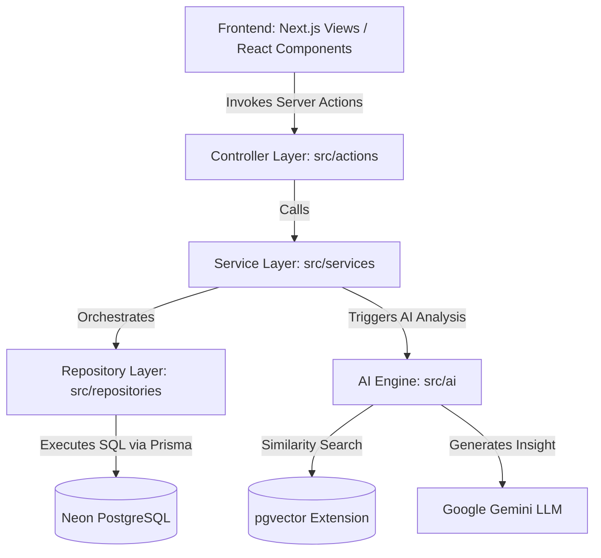

# CrimeGPT Collaborator Guide & Architecture Overview

Welcome to the team! This onboarding document is designed to help you quickly understand the **CrimeGPT** codebase, its architectural patterns, security requirements, and development workflows so that you can contribute confidently as a collaborator.

---

## 1. System Architecture & Data Flow

CrimeGPT is built as a highly structured, layered Next.js 15 application. It does not use a direct-from-page DB querying approach; instead, it enforces strict separation of concerns using the **Controller-Service-Repository** pattern.

### Architecture Flow Diagram



### Layer Breakdown

1. **Client / View Layer (`src/app`)**: Built with React 19 and Next.js App Router. Interacts with the backend exclusively via Next.js Server Actions.
2. **Controller Layer / Server Actions (`src/actions`)**:
   * Act as endpoint handlers.
   * Authenticate the request via NextAuth (`auth()`).
   * Extract the authenticated user ID (`userId`).
   * Validate input parameters.
   * Call the corresponding Service methods and return standardized response objects (e.g., `{ success: boolean, data?: T, message?: string }`).
3. **Service Layer (`src/services`)**:
   * Encapsulates core business logic.
   * Orchestrates multi-step processes (e.g., creating a case and generating a compliance audit log, or building a PDF draft).
   * Interfaces with the AI subsystem.
4. **Repository Layer (`src/repositories`)**:
   * Interfaces directly with the database using Prisma ORM.
   * **Mandatory User Scoping**: Isolates cases and resources by `userId`.
5. **AI Subsystem (`src/ai`)**:
   * Handles semantic RAG (Retrieval-Augmented Generation) queries against legal databases.
   * Houses reasoning chains for AI Diagnostics and Legal Appraisals.

---

## 2. Key Directories

Here is the directory structure you need to know:

```bash
crimegpt/
├── prisma/                  # Prisma schema definition
├── src/
│   ├── app/                 # Next.js pages, routing & layouts
│   ├── actions/             # Server Actions (Controller layer)
│   ├── services/            # Business logic layer
│   ├── repositories/        # Database access layer (Prisma wrappers)
│   ├── ai/                  # AI, RAG & Vector search systems
│   │   ├── chains/          # LangChain orchestration logic
│   │   ├── embeddings/      # HuggingFace MiniLM embedding models (384 dimensions)
│   │   ├── ingestion/       # Seeds & ingest scripts for vector db
│   │   ├── prompts/         # Prompt templates
│   │   ├── providers/       # LLM provider configuration (Gemini)
│   │   ├── retrievers/      # Custom semantic retrievers (deduplicated)
│   │   └── vector/          # PostgreSQL Vector store configuration
│   ├── lib/                 # Core singletons (e.g., prisma, pool)
│   ├── types/               # TypeScript interfaces & DTOs
│   └── scripts/             # Standalone test & diagnostics scripts
```

---

## 3. Critical Engineering Patterns (Must-Know)

To maintain codebase health, safety, and security, you must adhere to the following two core patterns:

### A. Strict User-Level Scoping
Because this application stores sensitive investigation files and personal testimonies, **cross-tenant data leakage is a critical risk**. 

* **Rule**: Repository queries must explicitly filter by the authenticated `userId`.
* **Example**:
  ```typescript
  // src/repositories/case.repository.ts
  export class CaseRepository {
    async findById(userId: string, id: string) {
      return prisma.case.findFirst({
        where: {
          id,
          userId, // Scope the check directly in the database query
        },
      });
    }
  }
  ```
* Never write generic queries like `prisma.case.findUnique({ where: { id } })` without validating that the authenticated user actually owns that resource.

### B. Hot-Reload Safety & Connection Pooling
In Next.js development, modules are hot-reloaded as code is saved. If you instantiate database connection clients directly in module scopes, a new instance is created on every save. This will quickly exhaust your database connection limits (especially on Neon, which has a 20-connection limit on free instances), resulting in `Connection terminated due to connection timeout` crashes.

We address this by saving the **Prisma Client** and the **PG Connection Pool** on `globalThis` to preserve them across hot-reloads:

```typescript
// src/lib/prisma.ts
declare const globalThis: {
  prismaGlobal: PrismaClient;
  pgPoolGlobal: Pool;
} & typeof global;

export const pool = globalThis.pgPoolGlobal ?? new Pool({
  connectionString,
  max: 10,
  idleTimeoutMillis: 30_000,
  connectionTimeoutMillis: 5_000,
  ssl: connectionString.includes("sslmode=require") || connectionString.includes("neon.tech")
    ? { rejectUnauthorized: false }
    : false,
});

if (process.env.NODE_ENV !== "production") {
  globalThis.pgPoolGlobal = pool;
}
```
* **Always** import your `prisma` client or connection `pool` from `@/lib/prisma`. Do not instantiate them manually in other files.

---

## 4. Semantic Search & RAG Pipeline

CrimeGPT uses local embeddings to run fast, secure RAG queries:
1. **Model**: HuggingFace `@huggingface/transformers` MiniLM-L6-v2 model running locally. It produces **384-dimensional** vector embeddings.
2. **Database Engine**: Neon PostgreSQL using the `pgvector` extension. Vector storage is managed via the table `ipc_chunks_embeddings`.
3. **Custom Retriever**: `DeduplicatedVectorStoreRetriever` retrieves $k \times 2$ similarity candidates and filters out duplicate text segments before returning them to the LLM context.

To populate the vector database with legal sections (e.g., IPC/BNS clauses):
```bash
# Run the ingestion script
npm run ingest:laws
```

---

## 5. Local Setup & Commands

Follow these steps to run the application locally:

### 1. Configure Environment Variables (`.env`)
Create a `.env` file in the root directory (based on `.env.example` if available) with the following key configurations:
```env
DATABASE_URL="postgresql://<user>:<password>@<host>/neondb?sslmode=verify-full"
GEMINI_API_KEY="AIzaSy..."

# Authentication Configuration (Auth.js v5)
AUTH_SECRET="your-generated-jwt-secret"
AUTH_URL="http://localhost:3000"

# Google OAuth Credentials
AUTH_GOOGLE_ID="google-client-id"
AUTH_GOOGLE_SECRET="google-client-secret"
```

### 2. Generate Prisma Client
Whenever the schema is modified or after installing dependencies:
```bash
npm run postinstall
# Or manually: npx prisma generate
```

### 3. Run Development Server
```bash
npm run dev
```
Open [http://localhost:3000](http://localhost:3000) in your browser.

### 4. Running Diagnostic and Test Scripts
Use `tsx` to execute server-side files in terminal scopes:
```bash
# Test the database case count
npx tsx src/scripts/check-cases.ts

# Test the AI Diagnostics Chain
npx tsx src/scripts/test-diagnostics.ts
```

---

## 6. Audit Logging & Compliance Checklists
Every database mutation (creation, modification, deletion) should trigger a `CaseActivity` record. This creates an unmodifiable audit log for compliance. 
* Use `caseActivityRepository.create()` or call the relevant logging hooks when writing service methods.
* Verify audit trail updates on the front-end Timeline view.

If you have any questions, feel free to ask senior team members or search current codebase implementations for examples!
